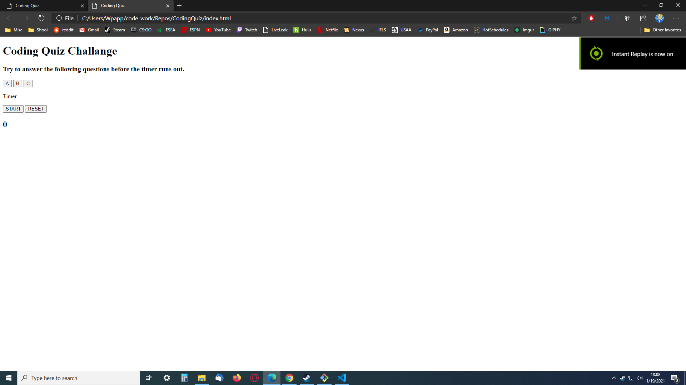

# CodingQuiz

* The motivation for this project was to create a quiz game that implements penalties and records user score.

# How to play:

* The quiz is short and simple. All you have to do is click start and answer the following 4 questions.  If the reset button is pressed at any time during the quiz, the quiz will be reset and your score will not be recorded (The number at the very bottom is your score for the current game). 

* If you answer incorrectly, a 5 second increment will be subtracted from your total time as well as a point deduction.  

* Once you've answered all questions BE SURE to push the submit button or the timer will not stop and the quiz will not end.

* If the timer reaches zero, the game will end, a point will be deducted form your score.

* Once all the questions are answered and the submit button is pressed, you will be presented with a prompt to enter your initals and
your final score will be recorded into local storage. 

* Highest possible score as of now is 4 points (1pt per question). 
 
# Current Bug

* If you click outside of the answer choice buttons a point will be dedudcted from the score.  This is because the event listener
is wired for the container and not the individual buttons.  Currently working on fix. 

# Screen shot of main page

